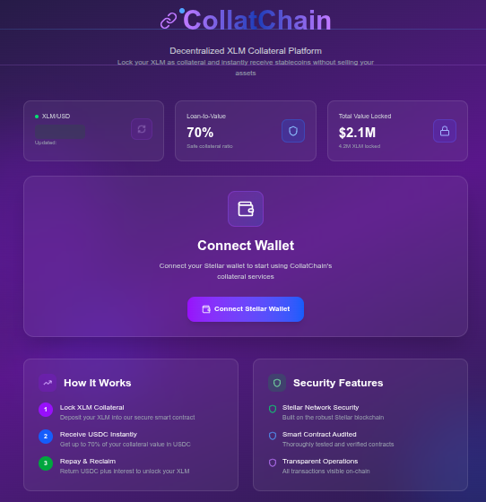
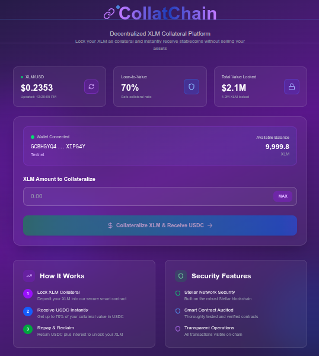

# CollatChain

**CollatChain** is a decentralized overcollateralized lending platform built on the **Stellar blockchain (Testnet)**. It allows users to stake their XLM tokens without selling them, and receive CBIT, a synthetic stable-value asset in return. This system preserves user exposure to XLM while unlocking liquidity, powered by Soroban smart contracts and integrated wallet interactions.

## 🚀 Purpose

The core mission of **CollatChain** is to empower crypto holders with access to liquidity **without forcing them to sell their assets**. By locking collateral (XLM), users can mint and utilize CBIT tokens, enabling lending, trading, or payments while maintaining ownership of their long-term holdings.

## 🤝 Team

- Efe Yılmaz
- Ömer Balaban 
---

# 🏗️ Core Technologies

#### Frontend:  
<code>Next.js + React + Tailwind CSS</code>

#### Wallet Integration:  
<code>@/stellar-wallets-kit</code>

#### Smart Contracts:  
<code>Rust + Stellar + Soroban SDK</code>

---

# 🔐 How It Works

1. **Stake XLM as Collateral**  
   Users connect their Freighter wallet and lock a chosen amount of XLM into the Vault contract.

2. **Receive CBIT**  
   70% of the staked XLM value (based on real-time price) is minted in the form of CBIT and transferred to the user.

3. **Withdraw & Burn**  
   Users can repay CBIT at any time to unlock their XLM. The system ensures overcollateralization by withholding 30% to avoid liquidation risks.

---

# 🔑 How to Connect Your Wallet

#### 1. Install one of Stellar Wallets (Freighter reccomended)  
#### 2. Open the app  
#### 3. Click on “Connect Wallet”  
#### 4. Approve the connection request in the wallet extension

---

Once connected, you’ll see:

- ✅ Your Stellar wallet address (shortened)  
- ✅ Connected network (Testnet)  
- ✅ Available XLM balance  
- ✅ Approximate USDC value

---

# 🧪 Development

### 📦 Install dependencies
```bash
cd app
npm install
```
### 🚀 Run Next.js frontend
```bash
cd /your/directory/frontend
```

### 🛠️ Build & deploy Soroban contracts (optional)

```bash
cd contract
soroban build
```
<hr>

# 📌 Roadmap / Future Work

   ✅ Vault creation and staking flow

   ✅ Dashboard (last transactions)
   
   ✅ Different tokenization contracts

   🔒 CBIT as Stable Coin

   🌍 Deployment on Futurenet

   📊 Dynamic liquidation ratios (phase 2)

   🤖 Machine learning for collateral risk analysis
   
   
   <hr>
   
# 📸 UI Snaphot





##### Built with ❤️, ☕, and 🤖 by Efe Yılmaz as Thorizodrago and Ömer Balaban as Balabanom for Stellar Hack Pera Hackathon 2025
